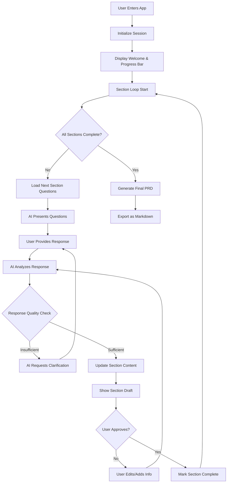

# AI-Powered PRD Generator - Comprehensive Requirements Document

## 1. Executive Summary

### 1.1 Product Overview
An AI-powered web application that guides users through creating professional Product Requirements Documents (PRDs) via an intelligent conversational interface. The system extracts necessary information through targeted questioning, validates responses, and generates a comprehensive PRD in markdown format.

### 1.2 Key Features
- Conversational AI interface for information extraction
- Section-by-section guided workflow with progress tracking
- Intelligent validation and quality assessment
- Real-time PRD preview and editing
- Export functionality for markdown files

## 2. System Architecture

### 2.1 High-Level Architecture
```
┌─────────────────┐     ┌──────────────────┐     ┌─────────────────┐
│   Frontend UI   │────▶│   Backend API    │────▶│  AI Service     │
│  (React/Next.js)│◀────│  (Node.js/Python)│◀────│  (LLM Provider) │
└─────────────────┘     └──────────────────┘     └─────────────────┘
         │                       │                         
         ▼                       ▼                         
┌─────────────────┐     ┌──────────────────┐              
│  State Manager  │     │    Database      │              
│   (Redux/Zustand)│     │  (PostgreSQL)    │              
└─────────────────┘     └──────────────────┘              
```

### 2.2 Core Modules

#### 2.2.1 Frontend Modules
- **ChatInterface.jsx**: Main chat container component
- **ProgressTracker.jsx**: Visual progress bar component
- **MessageList.jsx**: Displays conversation history
- **InputHandler.jsx**: User input processing
- **PreviewPanel.jsx**: Real-time PRD preview
- **ExportManager.jsx**: File export functionality

#### 2.2.2 Backend Modules
- **ConversationManager.js**: Manages conversation flow and state
- **ValidationEngine.js**: Response validation and scoring
- **ContextProcessor.js**: Extracts and maintains context
- **PromptGenerator.js**: Dynamic prompt creation
- **DocumentBuilder.js**: PRD assembly and formatting
- **SessionManager.js**: User session handling

#### 2.2.3 AI Service Modules
- **ResponseAnalyzer.js**: Analyzes user responses for completeness
- **QuestionGenerator.js**: Creates contextual follow-up questions
- **InformationExtractor.js**: Extracts relevant data from responses
- **QualityScorer.js**: Scores response quality

## 3. Data Models

### 3.1 Core Data Structures

```javascript
// User Session
interface UserSession {
  sessionId: string;
  userId?: string;
  createdAt: Date;
  lastActive: Date;
  currentSection: number;
  projectName: string;
  completedSections: Section[];
  draftPRD: PRDDocument;
}

// Section Data
interface Section {
  id: number;
  name: string;
  questions: Question[];
  responses: Response[];
  validationState: ValidationState;
  completionStatus: boolean;
  sectionContent: string;
}

// Question Model
interface Question {
  id: string;
  text: string;
  type: 'required' | 'optional' | 'contextual';
  validationRules: ValidationRule[];
  answered: boolean;
  quality: number; // 0-100
}

// Response Model
interface Response {
  questionId: string;
  content: string;
  timestamp: Date;
  qualityScore: number;
  extractedData: ExtractedData;
}

// Validation State
interface ValidationState {
  overallComplete: boolean;
  questionStates: {
    [questionId: string]: {
      answered: boolean;
      qualityScore: number;
      requiresFollowUp: boolean;
    }
  };
  userConsent: boolean;
}

// PRD Document
interface PRDDocument {
  sections: {
    introduction: IntroductionSection;
    goals: GoalsSection;
    audience: AudienceSection;
    userStories: UserStoriesSection;
    functionalReqs: FunctionalSection;
    metrics: MetricsSection;
    openQuestions: OpenQuestionsSection;
  };
  metadata: {
    createdAt: Date;
    lastModified: Date;
    version: string;
  };
}
```

## 4. Process Flow Definition

### 4.1 Main Workflow



### 4.2 Section Processing Logic

```javascript
class SectionProcessor {
  constructor() {
    this.sections = [
      'introduction',
      'goals',
      'targetAudience',
      'userStories',
      'functionalRequirements',
      'successMetrics',
      'openQuestions'
    ];
  }

  async processSection(sectionName, conversationHistory) {
    const questions = this.getQuestionsForSection(sectionName);
    const context = await this.extractContext(conversationHistory);
    
    // Skip questions already answered in context
    const unansweredQuestions = questions.filter(q => 
      !this.isQuestionAnsweredInContext(q, context)
    );
    
    return {
      questions: unansweredQuestions,
      context: context,
      validationRules: this.getValidationRules(sectionName)
    };
  }

  validateResponses(responses, section) {
    const validationResults = {};
    
    for (const [questionId, response] of Object.entries(responses)) {
      validationResults[questionId] = {
        answered: response.content.length > 0,
        qualityScore: this.calculateQualityScore(response, section),
        requiresFollowUp: this.needsFollowUp(response, section)
      };
    }
    
    return validationResults;
  }
}
```

## 5. AI Behavior Specifications

### 5.1 Conversation Management

```javascript
class AIConversationManager {
  constructor(llmProvider) {
    this.llm = llmProvider;
    this.conversationRules = {
      maxQuestionsPerTurn: 4,
      minQualityThreshold: 70,
      maxClarificationAttempts: 2,
      adaptiveQuestioningEnabled: true
    };
  }

  async generateResponse(userInput, section, context) {
    const prompt = this.buildPrompt({
      userInput,
      section,
      context,
      rules: this.conversationRules
    });
    
    const response = await this.llm.generate(prompt);
    
    return this.formatResponse(response, section);
  }

  buildPrompt({userInput, section, context, rules}) {
    return `
      You are an AI assistant helping create a PRD for section: ${section.name}
      
      Context from previous sections:
      ${JSON.stringify(context)}
      
      User's current input:
      ${userInput}
      
      Required information for this section:
      ${section.questions.map(q => q.text).join('\n')}
      
      Rules:
      - Extract all relevant information from the user's input
      - Identify which questions have been answered
      - Ask follow-up questions only for missing critical information
      - Be concise and friendly
      - Maximum ${rules.maxQuestionsPerTurn} questions per response
      
      Respond with:
      1. Acknowledgment of what was understood
      2. Any clarifying questions needed
      3. Confirmation if ready to proceed
    `;
  }
}
```

### 5.2 Quality Scoring Algorithm

```javascript
class QualityScorer {
  scoreResponse(response, questionType, sectionContext) {
    const scores = {
      completeness: this.scoreCompleteness(response),
      specificity: this.scoreSpecificity(response),
      relevance: this.scoreRelevance(response, sectionContext),
      clarity: this.scoreClarity(response)
    };
    
    // Weighted average based on question importance
    const weights = this.getWeights(questionType);
    
    return Object.entries(scores).reduce((total, [metric, score]) => {
      return total + (score * weights[metric]);
    }, 0);
  }

  scoreCompleteness(response) {
    // Check for key elements based on question type
    const requiredElements = this.getRequiredElements(response.questionType);
    const foundElements = requiredElements.filter(element => 
      response.content.toLowerCase().includes(element)
    );
    
    return (foundElements.length / requiredElements.length) * 100;
  }

  scoreSpecificity(response) {
    // Analyze for concrete details vs vague statements
    const specificityMarkers = [
      /\d+/, // Numbers
      /specifically|exactly|precisely/, // Specific language
      /"[^"]+"/, // Quoted values
      /\b(?:will|must|shall)\b/ // Definitive language
    ];
    
    const markerCount = specificityMarkers.filter(marker => 
      marker.test(response.content)
    ).length;
    
    return Math.min((markerCount / specificityMarkers.length) * 150, 100);
  }
}
```

## 6. Frontend Components

### 6.1 Main Application Component

```jsx
// App.jsx
import React, { useState, useEffect } from 'react';
import ChatInterface from './components/ChatInterface';
import ProgressTracker from './components/ProgressTracker';
import PreviewPanel from './components/PreviewPanel';
import { useSession } from './hooks/useSession';

function App() {
  const { session, updateSession } = useSession();
  const [currentSection, setCurrentSection] = useState(0);
  const [prdPreview, setPrdPreview] = useState('');
  
  const sections = [
    'Introduction/Overview',
    'Goals/Objectives',
    'Target Audience',
    'User Stories',
    'Functional Requirements',
    'Success Metrics',
    'Open Questions'
  ];

  return (
    <div className="app-container">
      <header className="app-header">
        <h1>AI PRD Generator</h1>
        <ProgressTracker 
          sections={sections}
          currentSection={currentSection}
          completedSections={session.completedSections}
        />
      </header>
      
      <main className="app-main">
        <ChatInterface
          section={sections[currentSection]}
          onSectionComplete={(sectionData) => {
            updateSession({
              completedSections: [...session.completedSections, sectionData]
            });
            setCurrentSection(currentSection + 1);
          }}
          context={session.context}
        />
        
        <PreviewPanel
          content={prdPreview}
          onEdit={(newContent) => setPrdPreview(newContent)}
        />
      </main>
    </div>
  );
}
```

### 6.2 Chat Interface Component

```jsx
// components/ChatInterface.jsx
import React, { useState, useRef, useEffect } from 'react';
import MessageList from './MessageList';
import InputHandler from './InputHandler';
import { useAI } from '../hooks/useAI';

function ChatInterface({ section, onSectionComplete, context }) {
  const [messages, setMessages] = useState([]);
  const [isProcessing, setIsProcessing] = useState(false);
  const [validationState, setValidationState] = useState({});
  const { processUserInput, generateSectionQuestions } = useAI();
  
  useEffect(() => {
    // Initialize section with AI-generated questions
    initializeSection();
  }, [section]);
  
  async function initializeSection() {
    const questions = await generateSectionQuestions(section, context);
    setMessages([{
      type: 'ai',
      content: questions,
      timestamp: new Date()
    }]);
  }
  
  async function handleUserInput(input) {
    // Add user message
    const userMessage = {
      type: 'user',
      content: input,
      timestamp: new Date()
    };
    setMessages(prev => [...prev, userMessage]);
    
    setIsProcessing(true);
    
    try {
      // Process input and get AI response
      const response = await processUserInput(input, section, context);
      
      // Update validation state
      setValidationState(response.validation);
      
      // Add AI response
      setMessages(prev => [...prev, {
        type: 'ai',
        content: response.message,
        timestamp: new Date()
      }]);
      
      // Check if section is complete
      if (response.sectionComplete) {
        onSectionComplete({
          section,
          content: response.sectionContent,
          responses: response.extractedData
        });
      }
    } catch (error) {
      console.error('Error processing input:', error);
      setMessages(prev => [...prev, {
        type: 'error',
        content: 'Sorry, I encountered an error. Please try again.',
        timestamp: new Date()
      }]);
    } finally {
      setIsProcessing(false);
    }
  }
  
  return (
    <div className="chat-interface">
      <MessageList messages={messages} />
      <InputHandler 
        onSubmit={handleUserInput}
        disabled={isProcessing}
        placeholder={`Tell me about ${section}...`}
      />
      <ValidationIndicator state={validationState} />
    </div>
  );
}
```

## 7. Backend API Endpoints

### 7.1 API Structure

```javascript
// routes/api.js
const express = require('express');
const router = express.Router();

// Session Management
router.post('/sessions', createSession);
router.get('/sessions/:id', getSession);
router.put('/sessions/:id', updateSession);

// Conversation Processing
router.post('/sessions/:id/messages', processMessage);
router.get('/sessions/:id/context', getContext);

// Section Management
router.get('/sessions/:id/sections/:sectionId', getSection);
router.put('/sessions/:id/sections/:sectionId', updateSection);
router.post('/sessions/:id/sections/:sectionId/validate', validateSection);

// PRD Generation
router.post('/sessions/:id/generate-prd', generatePRD);
router.get('/sessions/:id/prd/preview', getPreview);
router.get('/sessions/:id/prd/export', exportPRD);

// Templates
router.get('/templates', getTemplates);
router.get('/templates/:industry', getIndustryTemplate);
```

### 7.2 Core API Handlers

```javascript
// handlers/conversation.js
async function processMessage(req, res) {
  const { sessionId } = req.params;
  const { message, sectionId } = req.body;
  
  try {
    // Load session context
    const session = await SessionManager.getSession(sessionId);
    const context = await ContextProcessor.buildContext(session);
    
    // Analyze user input
    const analysis = await ResponseAnalyzer.analyze(message, sectionId, context);
    
    // Generate AI response
    const aiResponse = await AIService.generateResponse({
      userInput: message,
      analysis,
      section: sectionId,
      context
    });
    
    // Update session state
    await SessionManager.updateSession(sessionId, {
      lastMessage: message,
      sectionProgress: analysis.progress,
      extractedData: analysis.extractedData
    });
    
    // Build response
    res.json({
      response: aiResponse,
      validation: analysis.validation,
      sectionComplete: analysis.isComplete,
      nextSteps: analysis.nextSteps
    });
    
  } catch (error) {
    console.error('Error processing message:', error);
    res.status(500).json({ error: 'Failed to process message' });
  }
}
```

## 8. Validation Rules Engine

### 8.1 Validation Configuration

```javascript
// config/validationRules.js
const validationRules = {
  introduction: {
    productDescription: {
      minLength: 50,
      maxLength: 500,
      requiredElements: ['what', 'who', 'why'],
      qualityThreshold: 75
    },
    problemStatement: {
      minLength: 30,
      requiredElements: ['problem', 'impact', 'frequency'],
      qualityThreshold: 80
    },
    valueProposition: {
      minLength: 20,
      maxLength: 100,
      requiredElements: ['benefit', 'differentiator'],
      qualityThreshold: 85
    }
  },
  goals: {
    businessObjectives: {
      requiredElements: ['metric', 'target', 'timeframe'],
      minCount: 2,
      qualityThreshold: 90
    },
    smartCriteria: {
      required: ['specific', 'measurable', 'achievable', 'relevant', 'timebound'],
      qualityThreshold: 85
    }
  }
  // ... other sections
};
```

### 8.2 Validation Implementation

```javascript
// services/ValidationEngine.js
class ValidationEngine {
  constructor(rules) {
    this.rules = rules;
  }
  
  validateSection(sectionName, responses) {
    const sectionRules = this.rules[sectionName];
    const results = {
      overall: true,
      details: {},
      missingRequired: [],
      suggestions: []
    };
    
    for (const [field, rules] of Object.entries(sectionRules)) {
      const response = responses[field];
      const validation = this.validateField(response, rules);
      
      results.details[field] = validation;
      if (!validation.passed) {
        results.overall = false;
        if (validation.required) {
          results.missingRequired.push(field);
        }
      }
      
      if (validation.suggestions) {
        results.suggestions.push(...validation.suggestions);
      }
    }
    
    return results;
  }
  
  validateField(response, rules) {
    const result = {
      passed: true,
      score: 0,
      issues: [],
      suggestions: []
    };
    
    // Length validation
    if (rules.minLength && response.length < rules.minLength) {
      result.passed = false;
      result.issues.push(`Response too short (min: ${rules.minLength} chars)`);
      result.suggestions.push('Please provide more detail');
    }
    
    // Required elements check
    if (rules.requiredElements) {
      const missing = rules.requiredElements.filter(element => 
        !this.containsElement(response, element)
      );
      
      if (missing.length > 0) {
        result.passed = false;
        result.issues.push(`Missing required elements: ${missing.join(', ')}`);
        result.suggestions.push(`Please address: ${missing.join(', ')}`);
      }
    }
    
    // Quality scoring
    result.score = this.calculateQualityScore(response, rules);
    if (result.score < rules.qualityThreshold) {
      result.passed = false;
      result.suggestions.push('Consider adding more specific details');
    }
    
    return result;
  }
}
```

## 9. PRD Generation Engine

### 9.1 Document Builder

```javascript
// services/DocumentBuilder.js
class DocumentBuilder {
  constructor() {
    this.template = require('./templates/prdTemplate');
  }
  
  async buildPRD(sessionData) {
    const prd = {
      title: sessionData.projectName,
      generatedDate: new Date().toISOString(),
      sections: {}
    };
    
    // Process each section
    for (const [sectionName, sectionData] of Object.entries(sessionData.sections)) {
      prd.sections[sectionName] = await this.formatSection(
        sectionName, 
        sectionData
      );
    }
    
    // Generate markdown
    return this.generateMarkdown(prd);
  }
  
  formatSection(sectionName, data) {
    const formatter = this.getFormatter(sectionName);
    return formatter.format(data);
  }
  
  generateMarkdown(prd) {
    let markdown = `# ${prd.title}\n\n`;
    markdown += `*Generated on: ${new Date(prd.generatedDate).toLocaleDateString()}*\n\n`;
    markdown += `---\n\n`;
    
    // Table of Contents
    markdown += `## Table of Contents\n\n`;
    Object.keys(prd.sections).forEach((section, index) => {
      markdown += `${index + 1}. [${this.formatSectionTitle(section)}](#${section})\n`;
    });
    markdown += `\n---\n\n`;
    
    // Sections
    for (const [sectionKey, sectionContent] of Object.entries(prd.sections)) {
      markdown += `## ${this.formatSectionTitle(sectionKey)}\n\n`;
      markdown += sectionContent;
      markdown += `\n\n`;
    }
    
    return markdown;
  }
}
```

### 9.2 Section Formatters

```javascript
// formatters/IntroductionFormatter.js
class IntroductionFormatter {
  format(data) {
    let content = '';
    
    if (data.productDescription) {
      content += `### Product Description\n\n`;
      content += `${data.productDescription}\n\n`;
    }
    
    if (data.problemStatement) {
      content += `### Problem Statement\n\n`;
      content += `${data.problemStatement}\n\n`;
    }
    
    if (data.valueProposition) {
      content += `### Value Proposition\n\n`;
      content += `> "${data.valueProposition}"\n\n`;
    }
    
    if (data.scope) {
      content += `### Scope & Limitations\n\n`;
      content += `**In Scope:**\n`;
      data.scope.included.forEach(item => {
        content += `- ${item}\n`;
      });
      content += `\n**Out of Scope:**\n`;
      data.scope.excluded.forEach(item => {
        content += `- ${item}\n`;
      });
    }
    
    return content;
  }
}
```

## 10. Configuration Files

### 10.1 Environment Configuration

```javascript
// config/environment.js
module.exports = {
  development: {
    port: 3000,
    database: {
      host: 'localhost',
      port: 5432,
      name: 'prd_generator_dev',
      user: process.env.DB_USER,
      password: process.env.DB_PASSWORD
    },
    ai: {
      provider: 'openai',
      apiKey: process.env.OPENAI_API_KEY,
      model: 'gpt-4',
      temperature: 0.7,
      maxTokens: 2000
    },
    session: {
      secret: process.env.SESSION_SECRET,
      maxAge: 24 * 60 * 60 * 1000 // 24 hours
    }
  },
  production: {
    // Production config
  }
};
```

### 10.2 Section Configuration

```javascript
// config/sections.js
module.exports = {
  sections: [
    {
      id: 'introduction',
      name: 'Introduction/Overview',
      order: 1,
      questions: [
        {
          id: 'prod_desc',
          text: 'Can you provide a brief product description and its purpose?',
          type: 'required',
          validation: {
            minLength: 50,
            requiredKeywords: ['product', 'purpose']
          }
        },
        {
          id: 'problem',
          text: 'What problem does the product solve?',
          type: 'required',
          validation: {
            minLength: 30,
            requiredKeywords: ['problem', 'solve', 'issue']
          }
        },
        {
          id: 'value_prop',
          text: 'What is the high-level value proposition?',
          type: 'required',
          validation: {
            minLength: 20,
            maxLength: 100
          }
        },
        {
          id: 'scope',
          text: 'What is the scope of this document and what limitations should be noted?',
          type: 'required',
          validation: {
            requiresInScope: true,
            requiresOutOfScope: true
          }
        }
      ]
    },
    // ... other sections
  ]
};
```

## 11. Testing Strategy

### 11.1 Unit Tests

```javascript
// tests/ValidationEngine.test.js
describe('ValidationEngine', () => {
  let validator;
  
  beforeEach(() => {
    validator = new ValidationEngine(validationRules);
  });
  
  describe('validateField', () => {
    it('should pass valid product description', () => {
      const response = 'A comprehensive habit tracking application that helps users build and maintain daily routines through gamification and social accountability features.';
      const rules = validationRules.introduction.productDescription;
      
      const result = validator.validateField(response, rules);
      
      expect(result.passed).toBe(true);
      expect(result.score).toBeGreaterThan(75);
      expect(result.issues).toHaveLength(0);
    });
    
    it('should fail short responses', () => {
      const response = 'A habit app';
      const rules = validationRules.introduction.productDescription;
      
      const result = validator.validateField(response, rules);
      
      expect(result.passed).toBe(false);
      expect(result.issues).toContain('Response too short (min: 50 chars)');
    });
  });
});
```

### 11.2 Integration Tests

```javascript
// tests/integration/workflow.test.js
describe('PRD Generation Workflow', () => {
  it('should complete full PRD generation flow', async () => {
    // Create session
    const session = await request(app)
      .post('/api/sessions')
      .send({ projectName: 'Test Habit Tracker' });
    
    const sessionId = session.body.sessionId;
    
    // Process introduction section
    const introResponse = await request(app)
      .post(`/api/sessions/${sessionId}/messages`)
      .send({
        message: 'A habit tracking app that helps users build daily routines. It solves the problem of forgetting to maintain new habits. The value prop is "Build lasting habits in seconds a day". Scope includes basic habit creation and tracking, excludes social features.',
        sectionId: 'introduction'
      });
    
    expect(introResponse.body.sectionComplete).toBe(true);
    
    // Continue through other sections...
    
    // Generate final PRD
    const prdResponse = await request(app)
      .post(`/api/sessions/${sessionId}/generate-prd`);
    
    expect(prdResponse.status).toBe(200);
    expect(prdResponse.body.markdown).toContain('# Test Habit Tracker');
  });
});
```

## 12. Deployment Configuration

### 12.1 Docker Configuration

```dockerfile
# Dockerfile
FROM node:18-alpine

WORKDIR /app

# Copy package files
COPY package*.json ./
RUN npm ci --only=production

# Copy application files
COPY . .

# Build frontend
RUN npm run build

# Expose port
EXPOSE 3000

# Start application
CMD ["npm", "start"]
```

### 12.2 Docker Compose

```yaml
# docker-compose.yml
version: '3.8'

services:
  app:
    build: .
    ports:
      - "3000:3000"
    environment:
      - NODE_ENV=production
      - DATABASE_URL=postgresql://user:password@db:5432/prd_generator
      - REDIS_URL=redis://cache:6379
    depends_on:
      - db
      - cache
    volumes:
      - ./uploads:/app/uploads

  db:
    image: postgres:15
    environment:
      - POSTGRES_DB=prd_generator
      - POSTGRES_USER=user
      - POSTGRES_PASSWORD=password
    volumes:
      - postgres_data:/var/lib/postgresql/data

  cache:
    image: redis:7-alpine
    ports:
      - "6379:6379"

volumes:
  postgres_data:
```

## 13. Security Considerations

### 13.1 Authentication & Authorization
- Implement JWT-based authentication for user sessions
- Rate limiting on API endpoints
- Input sanitization for all user inputs
- XSS protection in frontend

### 13.2 Data Protection
- Encrypt sensitive data at rest
- Use HTTPS for all communications
- Implement CORS properly
- Regular security audits

## 14. Performance Optimization

### 14.1 Caching Strategy
- Cache AI responses for similar questions
- Redis for session management
- CDN for static assets

### 14.2 Optimization Techniques
- Lazy loading for frontend components
- Database query optimization
- Implement request debouncing
- Progressive PRD rendering

## 15. Optimization Strategies

### 15.1 Prompt Length Guardrails
To maintain predictable token costs and optimal performance:

```javascript
// services/ConversationCompressor.js
class ConversationCompressor {
  constructor() {
    this.maxTokensPerSection = 4000;
    this.compressionThreshold = 3000;
  }

  async compressConversation(messages, currentSection) {
    const tokenCount = this.estimateTokens(messages);
    
    if (tokenCount > this.compressionThreshold) {
      return this.compressMessages(messages, currentSection);
    }
    
    return messages;
  }

  compressMessages(messages, currentSection) {
    const compressed = [];
    
    // Keep system prompts and current section messages
    const systemMessages = messages.filter(m => m.role === 'system');
    const currentSectionMessages = messages.filter(m => 
      m.metadata?.section === currentSection
    );
    
    // Compress completed sections into summaries
    const completedSections = this.getCompletedSections(messages);
    
    for (const section of completedSections) {
      compressed.push({
        role: 'system',
        content: `[Section ${section.name} Summary]: ${section.summary}`,
        metadata: { compressed: true, originalTokens: section.tokenCount }
      });
    }
    
    // Add current section messages
    compressed.push(...systemMessages);
    compressed.push(...currentSectionMessages);
    
    return compressed;
  }

  generateSectionSummary(sectionMessages) {
    // Extract key information from section
    const extractedData = {
      questions: [],
      answers: [],
      decisions: [],
      requirements: []
    };
    
    // Compress into structured summary
    return JSON.stringify(extractedData);
  }
}
```

## 16. Future Enhancements

### 16.1 Phase 2 Features
- Multi-language support
- Team collaboration features
- Version control for PRDs
- Integration with project management tools
- Custom PRD templates
- AI-powered suggestions based on industry best practices

### 16.2 Phase 3 Features
- Voice input support
- Export to multiple formats (PDF, Word, Confluence)
- PRD comparison and analysis
- Automated requirement validation
- Integration with design tools

## 17. Step-by-Step Development Checklist (Prompt-Ready)

### 17.1 Initial Context Prompt

```
You are building an AI-powered PRD (Product Requirements Document) generator. The system guides users through creating PRDs via conversational AI. Here is the complete system specification:

ARCHITECTURE:
- Frontend: React/Next.js with chat interface, progress tracker, and real-time preview
- Backend: Node.js API with session management, validation engine, and AI integration
- Database: PostgreSQL for session/PRD storage
- AI Service: LLM integration for intelligent conversation management

KEY FEATURES:
1. Section-by-section guided workflow (7 sections total)
2. Intelligent response validation with quality scoring (0-100)
3. Context persistence across sections
4. Real-time PRD preview and export to markdown
5. Adaptive questioning based on previous answers

VALIDATION RULES:
- Each answer must meet quality threshold (configurable per section)
- System tracks completion state with granular validation
- Maximum 2 clarification attempts before accepting response
- Context from previous sections prevents redundant questions

TECHNICAL CONSTRAINTS:
- One file at a time development
- Complete, production-ready code (no placeholders)
- Test-driven development approach
- All files must pass their associated tests
```

### 17.2 Project Setup Prompt

```
Create the initial project structure for the AI PRD Generator. Initialize a new Node.js project with the following directory structure:

prd-generator/
├── backend/
│   ├── src/
│   │   ├── controllers/
│   │   ├── services/
│   │   ├── models/
│   │   ├── routes/
│   │   ├── middleware/
│   │   ├── utils/
│   │   └── config/
│   ├── tests/
│   └── package.json
├── frontend/
│   ├── src/
│   │   ├── components/
│   │   ├── hooks/
│   │   ├── services/
│   │   ├── utils/
│   │   └── styles/
│   ├── public/
│   ├── tests/
│   └── package.json
├── shared/
│   └── types/
├── docker-compose.yml
├── .env.example
└── README.md

Create the package.json files with these dependencies:
- Backend: express, cors, helmet, morgan, dotenv, joi, bcrypt, jsonwebtoken, pg, redis, openai
- Frontend: react, react-dom, next, axios, tailwindcss, react-query, zustand, react-markdown
- Dev dependencies: jest, supertest, @testing-library/react, typescript, eslint, prettier

Include all necessary scripts for development, testing, and production builds.
```

### 17.3 Test Directory Setup Prompt

```
Create the complete test directory structure for both backend and frontend with placeholder test files:

backend/tests/
├── unit/
│   ├── services/
│   │   ├── ValidationEngine.test.js
│   │   ├── ConversationManager.test.js
│   │   ├── ContextProcessor.test.js
│   │   ├── DocumentBuilder.test.js
│   │   └── QualityScorer.test.js
│   ├── controllers/
│   │   ├── sessionController.test.js
│   │   ├── conversationController.test.js
│   │   └── prdController.test.js
│   └── utils/
│       ├── tokenCounter.test.js
│       └── sanitizer.test.js
├── integration/
│   ├── workflow.test.js
│   ├── api.test.js
│   └── aiService.test.js
└── setup.js

frontend/tests/
├── components/
│   ├── ChatInterface.test.jsx
│   ├── ProgressTracker.test.jsx
│   ├── MessageList.test.jsx
│   └── PreviewPanel.test.jsx
├── hooks/
│   ├── useSession.test.js
│   └── useAI.test.js
└── setup.js

Each test file should have the basic structure with describe blocks and placeholder tests.
```

### 17.4 Backend Test Files (Individual Prompts)

#### Prompt 4A: ValidationEngine Test
```
Create the complete test file: backend/tests/unit/services/ValidationEngine.test.js

This test file validates the ValidationEngine service which:
- Validates user responses against section-specific rules
- Calculates quality scores (0-100) for responses
- Checks for required elements in responses
- Validates length constraints
- Provides specific feedback for improvements

The ValidationEngine has these methods:
- validateSection(sectionName, responses): returns validation results for entire section
- validateField(response, rules): validates individual field
- calculateQualityScore(response, rules): returns 0-100 score
- containsElement(response, element): checks if response contains required element

Test cases needed:
1. Valid responses pass all checks
2. Short responses fail minimum length validation
3. Missing required elements are detected
4. Quality scores are calculated correctly
5. Section validation aggregates field validations properly
6. Edge cases: empty responses, very long responses, special characters

Include setup/teardown, mock data, and comprehensive assertions.
```

#### Prompt 4B: ConversationManager Test
```
Create the complete test file: backend/tests/unit/services/ConversationManager.test.js

This test file validates the ConversationManager service which:
- Manages conversation flow between sections
- Tracks which questions have been answered
- Determines when to move to next section
- Handles user consent for section completion
- Manages conversation state and context

The ConversationManager has these methods:
- initializeSection(sectionName, context): returns initial questions
- processUserInput(input, section, context): processes and validates input
- shouldAskFollowUp(validation): determines if clarification needed
- canProceedToNext(validationState): checks if section is complete
- compressConversation(messages): compresses completed sections

Test cases needed:
1. Section initialization returns correct questions
2. User input processing extracts information correctly
3. Follow-up questions triggered for incomplete responses
4. Section progression blocked until all validations pass
5. Context carries forward to next sections
6. Conversation compression maintains essential information

Include async test handling, mocked dependencies, and state verification.
```

#### Prompt 4C: QualityScorer Test
```
Create the complete test file: backend/tests/unit/services/QualityScorer.test.js

This test file validates the QualityScorer service which:
- Scores response completeness (0-100)
- Scores response specificity based on concrete details
- Scores relevance to the question asked
- Scores clarity and structure
- Calculates weighted average based on question importance

The QualityScorer has these methods:
- scoreResponse(response, questionType, sectionContext): returns overall score
- scoreCompleteness(response): checks for required elements
- scoreSpecificity(response): analyzes concrete vs vague language
- scoreRelevance(response, context): ensures response addresses question
- scoreClarity(response): evaluates structure and readability
- getWeights(questionType): returns scoring weights by question type

Test cases needed:
1. High-quality responses score above 85
2. Vague responses score below 50
3. Specific details increase specificity score
4. Off-topic responses have low relevance scores
5. Well-structured responses score high on clarity
6. Weights properly applied based on question type

Include test data for various response qualities and comprehensive scoring verification.
```

### 17.5 Backend Service Files (Individual Prompts)

#### Prompt 5A: ValidationEngine Implementation
```
Create the complete service file: backend/src/services/ValidationEngine.js

Implement the ValidationEngine class that validates user responses for PRD sections. This service must:

1. Load validation rules from configuration
2. Validate entire sections and individual fields
3. Calculate quality scores for responses
4. Provide detailed feedback on validation failures
5. Support different validation rules per section

Required implementation details:
- Constructor accepts validation rules configuration object
- validateSection returns: {overall: boolean, details: {}, missingRequired: [], suggestions: []}
- validateField checks: length constraints, required elements, quality threshold
- Quality scoring considers: completeness, specificity, use of concrete language
- Suggestions are actionable and specific to the validation failure

Validation rules structure:
{
  introduction: {
    productDescription: {
      minLength: 50,
      maxLength: 500,
      requiredElements: ['what', 'who', 'why'],
      qualityThreshold: 75
    }
  }
}

Include error handling, logging, and ensure all methods are pure functions where possible. This file must pass all tests in ValidationEngine.test.js.
```

#### Prompt 5B: ConversationManager Implementation
```
Create the complete service file: backend/src/services/ConversationManager.js

Implement the ConversationManager class that orchestrates the conversation flow. This service must:

1. Initialize sections with appropriate questions
2. Process user inputs and extract information
3. Determine when follow-up questions are needed
4. Track conversation state and progress
5. Manage context between sections
6. Compress completed sections to manage token usage

Required implementation details:
- Maintains conversation state including: current section, answered questions, validation states
- initializeSection skips questions already answered in context
- processUserInput returns: {response: string, validation: object, sectionComplete: boolean, extractedData: object}
- Implements intelligent follow-up logic (max 2 attempts per question)
- Context object structure: {previousSections: {}, currentResponses: {}, sessionMetadata: {}}

Integration points:
- Uses ValidationEngine for response validation
- Uses QualityScorer for response quality assessment
- Uses PromptGenerator for creating AI prompts
- Uses ContextProcessor for context management

Include proper error handling, state management, and ensure thread safety. This file must pass all tests in ConversationManager.test.js.
```

#### Prompt 5C: QualityScorer Implementation
```
Create the complete service file: backend/src/services/QualityScorer.js

Implement the QualityScorer class that evaluates response quality. This service must:

1. Score responses on multiple dimensions (completeness, specificity, relevance, clarity)
2. Apply weighted scoring based on question importance
3. Detect specific language patterns indicating quality
4. Provide granular scoring feedback
5. Support customizable scoring thresholds

Required implementation details:
- scoreResponse returns number 0-100 with breakdown by dimension
- Completeness: checks for presence of required conceptual elements
- Specificity: rewards concrete details, numbers, quotes, definitive language
- Relevance: uses NLP techniques to match response to question intent
- Clarity: evaluates sentence structure, paragraph organization, logical flow

Scoring patterns to detect:
- Specific: numbers, dates, proper nouns, technical terms
- Vague: "probably", "maybe", "kind of", "stuff", "things"
- Structured: bullet points, numbered lists, clear paragraphs
- Detailed: examples, scenarios, edge cases mentioned

Weights by question type:
- Required questions: completeness 40%, specificity 30%, relevance 20%, clarity 10%
- Optional questions: relevance 40%, specificity 30%, completeness 20%, clarity 10%

Include helper methods for pattern detection and ensure deterministic scoring. This file must pass all tests in QualityScorer.test.js.
```

### 17.6 API Route Files (Individual Prompts)

#### Prompt 6A: Session Routes
```
Create the complete route file: backend/src/routes/sessionRoutes.js

Implement all session-related API endpoints:

POST /api/sessions
- Creates new PRD session
- Request body: {projectName: string, template?: string}
- Response: {sessionId: string, createdAt: timestamp}
- Initializes empty PRD structure and first section

GET /api/sessions/:sessionId
- Retrieves session state
- Response: {session object with all progress data}
- Includes: current section, completed sections, draft content

PUT /api/sessions/:sessionId
- Updates session metadata
- Request body: {projectName?: string, lastActive: timestamp}
- Validates session ownership

DELETE /api/sessions/:sessionId
- Soft deletes session
- Maintains data for 30 days before hard delete

GET /api/sessions/:sessionId/export
- Exports session data as JSON
- Includes all responses and generated content

Route requirements:
- Input validation using Joi schemas
- Session existence verification middleware
- Proper error handling with status codes
- Request logging
- Rate limiting: 100 requests per hour per IP

Include middleware setup, error handling, and integration with SessionController.
```

#### Prompt 6B: Conversation Routes
```
Create the complete route file: backend/src/routes/conversationRoutes.js

Implement conversation management endpoints:

POST /api/sessions/:sessionId/messages
- Processes user message in conversation
- Request body: {message: string, sectionId: string}
- Response: {aiResponse: string, validation: object, sectionComplete: boolean, nextSteps: object}
- Handles message processing through ConversationManager

GET /api/sessions/:sessionId/context
- Retrieves current conversation context
- Response: {context object with previous responses and current state}
- Used for maintaining conversation continuity

POST /api/sessions/:sessionId/sections/:sectionId/validate
- Validates current section responses
- Response: {valid: boolean, details: object, suggestions: array}
- Triggers section completion if valid

GET /api/sessions/:sessionId/sections/:sectionId
- Retrieves section details and progress
- Response: {questions: array, responses: object, validationState: object}

PUT /api/sessions/:sessionId/sections/:sectionId
- Updates section content directly
- Request body: {responses: object, draft: string}
- For manual edits to section content

Route requirements:
- Message sanitization for XSS prevention
- Session state verification before processing
- Async error handling wrapper
- Response compression for large contexts
- WebSocket support preparation for real-time updates

Include all necessary middleware and error handling.
```

### 17.7 Frontend Component Files (Individual Prompts)

#### Prompt 7A: ChatInterface Component
```
Create the complete component file: frontend/src/components/ChatInterface.jsx

Implement the main chat interface component that:

1. Displays conversation messages in a scrollable container
2. Handles user input with a text area that auto-expands
3. Shows typing indicators when AI is processing
4. Displays validation feedback inline
5. Manages message history with proper timestamps

Component requirements:
- Props: {section: string, onSectionComplete: function, context: object}
- State: messages array, isProcessing boolean, validationState object
- Uses useAI hook for AI interactions
- Auto-scrolls to newest messages
- Supports markdown rendering in messages
- Shows section-specific placeholder text
- Implements message retry on error
- Keyboard shortcuts: Enter to send, Shift+Enter for new line

UI specifications:
- Message bubbles with distinct styles for user/AI
- Timestamp on hover
- Copy button for code blocks
- Loading animation during processing
- Error state with retry button
- Character count for long inputs
- Section progress indicator

Styling: Use Tailwind CSS classes, responsive design, dark mode support
Performance: Virtualized scrolling for long conversations, memoized message rendering

Include PropTypes validation and comprehensive error boundaries.
```

#### Prompt 7B: ProgressTracker Component
```
Create the complete component file: frontend/src/components/ProgressTracker.jsx

Implement the visual progress tracker component that:

1. Shows all 7 PRD sections as a horizontal progress bar
2. Indicates current section, completed sections, and upcoming sections
3. Allows navigation to previous sections (not forward)
4. Shows validation status for each section
5. Displays section names and completion percentage

Component requirements:
- Props: {sections: array, currentSection: number, completedSections: array, onSectionClick: function}
- Visual states: not started, in progress, needs revision, completed
- Animated transitions between states
- Tooltip on hover showing section details
- Mobile responsive (vertical on small screens)

UI specifications:
- Step indicators with connecting lines
- Color coding: gray (not started), blue (current), yellow (needs revision), green (completed)
- Icons for each section type
- Completion checkmarks with animation
- Section number badges
- Progress percentage text

Accessibility:
- ARIA labels for screen readers
- Keyboard navigation support
- Focus indicators
- Status announcements

Styling: Modern, clean design with smooth animations and transitions

Include unit tests for all interactive behaviors.
```

#### Prompt 7C: PreviewPanel Component
```
Create the complete component file: frontend/src/components/PreviewPanel.jsx

Implement the PRD preview panel component that:

1. Displays real-time PRD preview in markdown
2. Supports live editing of generated content
3. Shows table of contents with navigation
4. Includes export functionality
5. Provides print-friendly view

Component requirements:
- Props: {content: string, onEdit: function, sessionId: string}
- Split view: preview and edit modes
- Syntax highlighting for markdown
- Auto-save with debouncing
- Export formats: Markdown, PDF, DOCX
- Copy to clipboard functionality

UI features:
- Collapsible panel (desktop) or modal (mobile)
- Toolbar with formatting buttons
- Search within document
- Zoom controls
- Full-screen mode
- Version comparison (if edits made)

Editor specifications:
- Markdown shortcuts support
- Live preview updates
- Undo/redo functionality
- Find and replace
- Section folding
- Line numbers in edit mode

Performance:
- Debounced preview updates
- Virtual scrolling for large documents
- Lazy loading for export libraries

Include keyboard shortcuts help panel and comprehensive error handling.
```

### 17.8 Integration Files (Individual Prompts)

#### Prompt 8A: AI Service Integration
```
Create the complete integration file: backend/src/services/AIService.js

Implement the AI service integration that:

1. Interfaces with OpenAI API (or other LLM providers)
2. Manages prompt templates for each section
3. Handles token counting and limits
4. Implements retry logic with exponential backoff
5. Provides response streaming support

Service requirements:
- Configurable model selection (GPT-4, GPT-3.5, etc.)
- Dynamic prompt construction based on context
- Token usage tracking and optimization
- Response caching for similar queries
- Error handling for API failures

Core methods:
- generateResponse(prompt, options): Returns AI response
- streamResponse(prompt, onChunk): Streams response chunks
- countTokens(text): Returns token count
- optimizePrompt(prompt, maxTokens): Truncates safely

Prompt templates structure:
{
  introduction: {
    system: "You are helping create a PRD. Extract key information...",
    examples: [{user: "...", assistant: "..."}],
    temperature: 0.7
  }
}

Safety features:
- Content filtering
- Rate limiting per session
- Fallback responses for API failures
- Prompt injection prevention
- Token budget management

Include comprehensive logging and monitoring hooks.
```

#### Prompt 8B: Database Models
```
Create the complete models file: backend/src/models/index.js

Implement all database models using Sequelize ORM:

1. Session model
- id: UUID primary key
- userId: foreign key (nullable for anonymous)
- projectName: string
- status: enum (active, completed, archived)
- currentSection: integer
- createdAt, updatedAt timestamps

2. SectionResponse model
- id: UUID primary key
- sessionId: foreign key
- sectionName: string
- responses: JSONB
- validationState: JSONB
- content: TEXT (generated markdown)
- version: integer

3. ConversationMessage model
- id: UUID primary key
- sessionId: foreign key
- role: enum (user, assistant, system)
- content: TEXT
- metadata: JSONB
- createdAt timestamp

4. PRDDocument model
- id: UUID primary key
- sessionId: foreign key
- content: TEXT (full markdown)
- metadata: JSONB
- exportedAt: timestamp

Model relationships:
- Session hasMany SectionResponses
- Session hasMany ConversationMessages
- Session hasOne PRDDocument

Include indexes for performance, model validations, hooks for data sanitization, and migration files.
```

### 17.9 Configuration Files (Individual Prompts)

#### Prompt 9A: Validation Rules Configuration
```
Create the complete configuration file: backend/src/config/validationRules.js

Define comprehensive validation rules for all PRD sections:

1. Introduction/Overview rules
- Product description: 50-500 chars, must mention what/who/why
- Problem statement: 30+ chars, must describe impact
- Value proposition: 20-100 chars, must be quotable
- Scope: must have in-scope and out-of-scope items

2. Goals/Objectives rules
- Minimum 2 goals required
- Each goal must be SMART (specific criteria for each)
- Business metrics must include numbers
- Timeframes must be specified

3. Target Audience rules
- At least one primary persona required
- Must include demographics and pain points
- Market size estimation required
- Use cases must be specific

4. User Stories rules
- Format validation: "As a..., I want..., so that..."
- Acceptance criteria required
- Priority levels must be set
- Minimum 5 stories for MVP

5. Functional Requirements rules
- Feature specifications must be detailed
- Technical constraints must be noted
- Integration points must be specified
- Data schemas required for data features

6. Success Metrics rules
- KPIs must be measurable
- Baseline and target values required
- Measurement methods must be specified

7. Open Questions rules
- At least 3 considerations required
- Risk assessment needed
- Future phases should be mentioned

Export as a frozen object with comprehensive rule definitions.
```

#### Prompt 9B: Section Questions Configuration
```
Create the complete configuration file: backend/src/config/sectionQuestions.js

Define all questions for each PRD section with metadata:

Structure for each question:
{
  id: string,
  text: string,
  type: 'required' | 'optional' | 'conditional',
  helpText: string,
  examples: array,
  followUpTriggers: object,
  validationRules: object
}

Include:
1. Primary questions for each section
2. Conditional follow-up questions based on responses
3. Help text and examples for each question
4. Question dependencies and skip logic
5. Dynamic question generation rules

Special considerations:
- Questions should be conversational, not form-like
- Include variations for different industry contexts
- Support for technical vs non-technical users
- Progressive disclosure of complex questions

Export as versioned configuration with migration support.
```

### 17.10 Utility Files (Individual Prompts)

#### Prompt 10A: Context Processor Utility
```
Create the complete utility file: backend/src/utils/ContextProcessor.js

Implement context extraction and management utilities:

1. extractContext(messages): Extracts key information from conversation
2. mergeContexts(previous, current): Combines contexts intelligently
3. summarizeSection(sectionData): Creates concise section summary
4. findAnsweredQuestions(context, questions): Identifies already-answered questions
5. buildPromptContext(context, section): Formats context for AI prompts

Context structure:
{
  projectInfo: {name, type, description},
  previousSections: {
    sectionName: {summary, keyDecisions, requirements}
  },
  entities: {
    users: [], features: [], technologies: []
  },
  constraints: {technical: [], business: []},
  terminology: Map<string, string>
}

Intelligence features:
- Entity recognition and tracking
- Terminology consistency enforcement
- Contradiction detection
- Implicit information inference
- Context compression for token limits

Include NLP utilities for entity extraction and comprehensive test coverage.
```

#### Prompt 10B: Markdown Formatter Utility
```
Create the complete utility file: backend/src/utils/MarkdownFormatter.js

Implement markdown formatting utilities for PRD generation:

1. formatSection(sectionName, content): Formats section with proper headers
2. createTableOfContents(sections): Generates linked TOC
3. formatUserStory(story): Formats user stories consistently
4. createRequirementsTable(requirements): Tabular requirement display
5. addMetadata(document, metadata): Adds document headers/footers

Formatting features:
- Consistent heading hierarchy
- Automatic numbering for sections
- Code block formatting for technical specs
- Table generation for structured data
- Blockquote styling for important notes
- Task list formatting for action items

Special formatting:
- SMART goals as structured lists
- User personas as cards/tables
- Success metrics as charts (ASCII)
- Risk matrix visualization
- Glossary auto-generation

Export utilities:
- Clean markdown for GitHub
- Enriched markdown for Confluence
- PDF-friendly formatting options

Include template system for customization and output validation.
```

### 17.11 Frontend Hook Files (Individual Prompts)

#### Prompt 11A: useAI Hook
```
Create the complete hook file: frontend/src/hooks/useAI.js

Implement the AI interaction hook that:

1. Manages AI service communication
2. Handles request/response state
3. Implements retry logic
4. Provides streaming support
5. Caches responses

Hook interface:
const {
  sendMessage,
  streamMessage,
  isLoading,
  error,
  retry,
  messages
} = useAI(sessionId, section);

Features:
- Automatic session context inclusion
- Optimistic UI updates
- Error recovery with exponential backoff
- Message history management
- Typing indicators
- Network status awareness

API integration:
- REST for standard messages
- WebSocket for streaming
- Fallback mechanisms
- Request cancellation
- Progress tracking for long operations

State management:
- Integration with global state (Zustand)
- Local message cache
- Persistence across refreshes
- Undo/redo support

Include TypeScript definitions and comprehensive error handling.
```

#### Prompt 11B: useSession Hook
```
Create the complete hook file: frontend/src/hooks/useSession.js

Implement session management hook that:

1. Manages PRD session lifecycle
2. Syncs with backend automatically
3. Handles offline support
4. Provides session recovery
5. Manages drafts and auto-save

Hook interface:
const {
  session,
  createSession,
  updateSession,
  saveSection,
  exportPRD,
  syncStatus
} = useSession();

Features:
- Real-time sync with debouncing
- Conflict resolution for concurrent edits
- Local storage backup
- Session restoration after disconnect
- Progress tracking across devices

State synchronization:
- Optimistic updates
- Background sync queue
- Merge strategies for conflicts
- Version tracking
- Rollback capability

Performance:
- Selective sync (only changed data)
- Compression for large sessions
- Lazy loading of historical data
- Memory management for long sessions

Include offline indicators and sync status UI helpers.
```

### 17.12 Testing Strategy Implementation

#### Prompt 12A: E2E Test Suite
```
Create the complete E2E test file: tests/e2e/fullWorkflow.test.js

Implement end-to-end tests that validate the complete PRD generation flow:

Test scenarios:
1. Complete PRD generation from start to finish
2. Resume interrupted session
3. Navigate between sections
4. Edit and update responses
5. Export final document

Test flow:
- Create new session
- Answer all questions for each section
- Verify validation works correctly
- Test section navigation
- Modify previous responses
- Generate and export PRD
- Verify markdown output

Edge cases:
- Network interruption recovery
- Invalid input handling
- Session timeout behavior
- Concurrent session editing
- Large document handling

Use Playwright or Cypress with:
- Page object pattern
- Custom commands for common actions
- Screenshot on failure
- Performance metrics collection
- Accessibility testing

Include CI/CD integration configuration.
```

#### Prompt 12B: Performance Test Suite
```
Create the complete performance test file: tests/performance/loadTest.js

Implement performance tests using k6 or Artillery:

Test scenarios:
1. Concurrent user sessions (100 users)
2. Message processing throughput
3. AI response time under load
4. Database query optimization
5. Export generation performance

Metrics to track:
- Response time percentiles (p50, p95, p99)
- Requests per second
- Error rates
- Token usage per session
- Database connection pool usage
- Memory consumption
- CPU utilization

Performance targets:
- API response time < 200ms (non-AI)
- AI response time < 3s
- Export generation < 5s
- 99.9% uptime
- Support 1000 concurrent sessions

Stress test scenarios:
- Spike testing (sudden load increase)
- Endurance testing (sustained load)
- Volume testing (large PRDs)
- Breakpoint testing (find limits)

Include performance regression detection and automated reporting.
```

### 17.13 Deployment Configuration

#### Prompt 13A: Production Dockerfile
```
Create the complete multi-stage Dockerfile for production deployment:

Requirements:
1. Separate build stages for frontend and backend
2. Security hardening (non-root user, minimal base image)
3. Health check endpoints
4. Optimal layer caching
5. Environment variable validation

Include:
- Node.js 18 Alpine base
- Production dependency installation only
- Frontend build with optimization
- Static asset compression
- Security scanning integration
- Container size optimization (target < 200MB)
- Graceful shutdown handling
- Prometheus metrics endpoint

Configuration for:
- Different deployment environments (staging, production)
- Secret management integration
- Log aggregation setup
- APM instrumentation

Include docker-compose for local development and Kubernetes manifests for production.
```

#### Prompt 13B: CI/CD Pipeline
```
Create the complete GitHub Actions workflow file: .github/workflows/deploy.yml

Implement CI/CD pipeline that:

1. Runs on PR and main branch pushes
2. Executes all test suites in parallel
3. Builds and publishes Docker images
4. Deploys to appropriate environment
5. Runs post-deployment tests

Pipeline stages:
- Lint and format check
- Unit tests with coverage
- Integration tests
- Build applications
- Security scanning (SAST, dependency check)
- Docker image build and scan
- Deploy to staging
- E2E tests on staging
- Deploy to production (manual approval)
- Smoke tests on production

Features:
- Matrix testing (Node versions)
- Caching for dependencies
- Artifact storage
- Deployment rollback capability
- Slack/Discord notifications
- Performance regression alerts

Include environment secrets configuration and branch protection rules.
```

This completes the comprehensive development checklist with individual, prompt-ready instructions for building the entire system one file at a time, with tests created before implementation code.